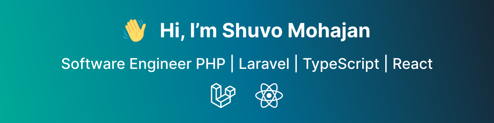

- 🔭 I’m currently working on [Bit Apps](https://bitapps.pro/)
- 🌱 I’m currently learning DSA, OOP, Clean Code, Design Patterns, Design Principles, TDD, Microservices, Scrum, CI/CD, Docker, etc.
- 👯 I’m looking to collaborate on Open Source Projects
- 📫 Reach me at [Linkedin](https://www.linkedin.com/in/shuvomohajan)

<!-- languages and tools with special logo -->

### ✔ Languages and Tools

<!-- Backend Technologies -->

<!-- Database -->

<!-- Frontend Technologies -->

<!-- Tools and Platforms -->

<!-- OS -->

### ✔ Github Activities

<!--  -->
